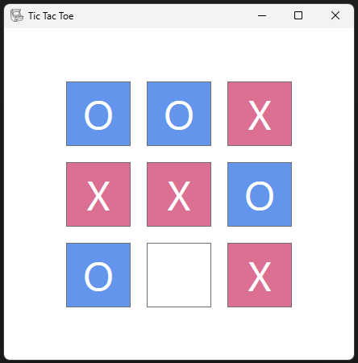
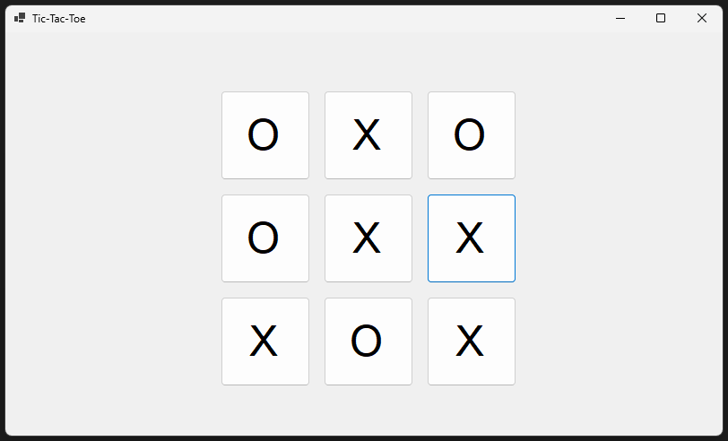
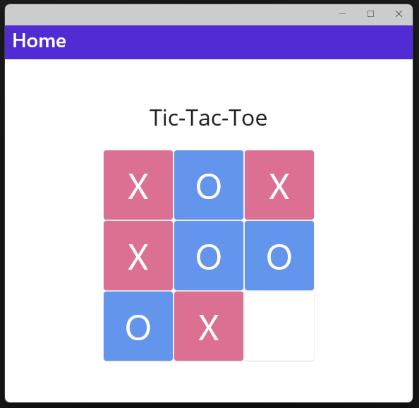

# Tic-Tac-Toe

C# Library for Tic-Tac-Toe, with front ends in WPF, WinForms and .NET MAUI.

Includes playable CPU Opponents which implement [Minimax](https://en.wikipedia.org/wiki/Minimax):
- 'CPUOpponent' (C#)
- 'CPPOpponent' (C++ via P/Invoke)

## WPF App

**Ctrl+N** - New Game

**Esc** - Exit

## WinForms App

**Ctrl+N** - New Game

**Esc** - Exit

## .NET MAUI App

