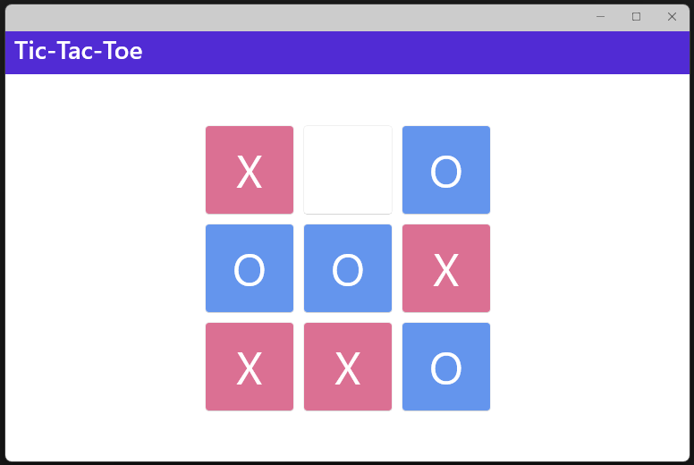

# Tic-Tac-Toe

C# Library for Tic-Tac-Toe, with front ends in WPF, WinForms and .NET MAUI.

## WPF App

**Ctrl+N** - New Game

**Esc** - Exit

## WinForms App

**Ctrl+N** - New Game

**Esc** - Exit

## .NET MAUI App

